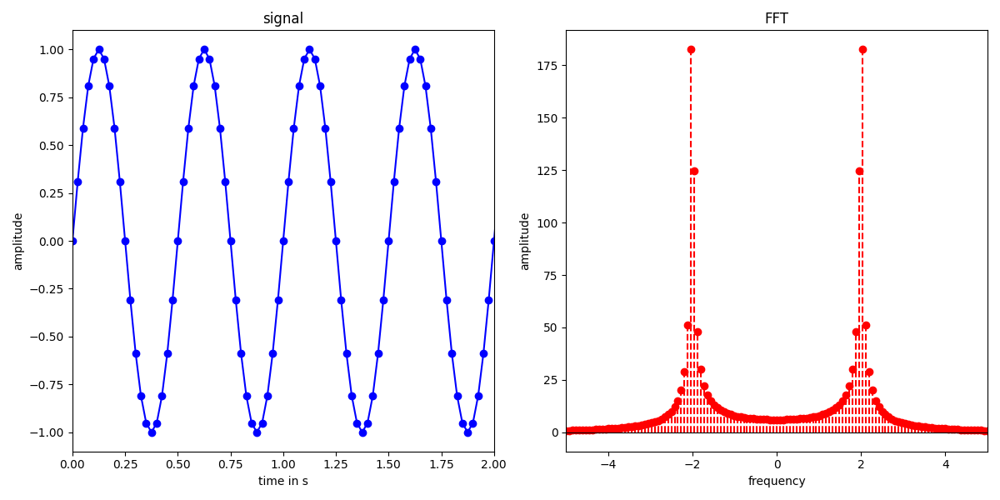

# FFT (Fast Fourier Transform)

This project implements the  **Fast Fourier Transform (FFT)** algorithm, based on the **Danielson-Lanczos Lemma**, providing computation of discrete Fourier transforms and their inverses.

## How to use

This FFT implementation supports forward and inverse transforms on arrays or vectors.

### Input Requirements

- The input data must contain a number of elements that is a power of 2.
- If an array is provided, its size must already be a power of 2.
- If a vector is provided, it is automatically **zero-padded** to the next power of 2 if necessary.

### Data Format

The FFT operates on complex numbers stored in an interleaved format:

```math
Real(f_0), Im(f_0), Real(f_1), Im(f_1), ...
```

The transformed output follows the same format:

```math
Real(F_0), Im(F_0), Real(F_1), Im(F_1), ...
```

### Behavior

- The input array or vector is **overwritten** with the transformed FFT or IFFT values.
- Applying the inverse FFT restores the original time-domain signal.

### Time- and Frequency-domain resolution

The FFT operates on an array of time-domain values and returns an array of frequency-domain values. The actual time or frequency values corresponding to each array element are not provided by the FFT and must be computed separately by the user.

If the spacing between consecutive time-domain samples (sampling rate) is $\Delta t$, and there are $N$ total data points, then the spacing in the frequency domain is given by: 

```math
\Delta \nu = \frac{1}{N \Delta t} \ .
```

The resulting frequency values corresponding to the FFT output are:

```math
\nu = 0, \frac{1}{N \Delta t}, \frac{2}{N \Delta t}, \cdots, \frac{N-1}{N \Delta t} \ .
```

Due to the periodicity and symmetry properties of the discrete Fourier transform, specifically $F_{N-n} = F_{-n}$, the frequency axis is usually rearranged to center around zero. This gives:

```math
\nu = 0, \frac{1}{N \Delta t}, \cdots, \pm \frac{1}{2 \Delta t}, - \frac{N/2-1}{N \Delta t}, \cdots, -\frac{1}{N \Delta t} \ .
```

Thus, the highest frequency that can be resolved (the Nyquist frequency) is:

```math
\nu_{Nyq} = \frac{1}{2\Delta t} \ .
```

### Example 
A complete example demonstrating the FFT on a sinusoidal signal is provided in main.cpp.

The example writes its output to a file `fft.dat` with the following column format:

```c++
t    signal    freq    fft_component
```

You can visualize the results using the included plot script, which reads this file format.



#### Build and Run

You can compile the example using:

```c++
g++ -std=c++20 -I../include -Wall -O3 -march=native -o main main.cpp 
```

If you use Meson, you can build with:

```bash
meson setup builddir
cd builddir
meson compile main
```

Then run the program:

```c++
./main
```

This will generate the output file from plotting in the same directory as the input file.
To visualize the results, run the plot script:

```python
python3 plot_fft.py fft.dat
```

## How it Works

Given $N$ data points of a signal in the time domain, $f_k$, the **Fourier Transformation (FFT)** is computed to obtain the frequency components.

### Fourier Transform (DFT)

The amplitude of the $n$-th frequency component $F_n$ is given by:

```math
F_n = \sum_{k=0}^{N-1} f_k \exp\left(\frac{2\pi i}{N} nk \right)
```

Given $N$ points in the frequency domain, the inverse transformation to recover the time-domain signal is:

```math
f_k = \frac{1}{N} \sum_{n=0}^{N-1} F_n \exp\left(\frac{-2\pi i}{N} nk \right)
```

Where:

- $F_n$ is the Fourier coefficient for the $n$-th frequency component.
- $f_k$ is the value of the signal at the $k$-th time point.
- $N$ is the total number of data points.

At this point, we can also see, that the DFT is periodic, satisfying $F_{-n} = F_{N-n}$.

#### Example

Assume we have a cosine signal, $f(t) = \cos(2\pi t)$. This signal has an angular frequency $\omega = 2\pi$, and therefore a frequency of $f = 1 \text{Hz}$ (since $\omega = 2 \pi f$).

The cosine function can be rewritten in terms of complex exponentials using Euler's formula:

```math
f(t) = \cos(2\pi t) = \frac{1}{2} \left(\exp(2\pi i t) + \exp(-2\pi i t) \right) \ .
```
Here, we have used Euler's formula, which expresses the cosine function as a sum of complex exponentials with frequencies
$-1$ and $+1$ in the form of $\exp(\pm2\pi i t)$.

### Danielson-Lanczos Lemma

This lemma provides a method to recursively split the DFT, which forms the basis of efficient algorithms like the FFT, reducing the complexity to $\mathcal{O}(N\log_{2}N)$, where $N$ is the number of data points.

The sum in the DFT can be split into even and odd terms:

```math
F_n = \sum_{k=0}^{N-1} f_k \exp\left(\frac{2\pi i}{N} nk \right) = \\ 
\sum_{k=0}^{N/2-1} f_{2k} \exp\left(\frac{2\pi i}{N} n(2k) \right) + \sum_{k=0}^{N/2-1} f_{2k+1} \exp\left(\frac{2\pi i}{N} n(2k+1) \right) \ .
```
So, 

```math
F_n = F_n^e + W_N^n F_n^o \ ,
```

where:

- $F_n^e = \sum_{k=0}^{N/2-1} f_{2k} \exp\left(\frac{2\pi i}{N/2} n(k) \right)$.
- $F_n^o = \sum_{k=0}^{N/2-1} f_{2k+1} \exp\left(\frac{2\pi i}{N/2} n(k) \right)$.
- $W_N = \exp\left(\frac{2\pi i}{N}\right)$.

This process can be repeated recursively. The even and odd sequences can again be split into even and odd subsequences, following a structure like: $(0, 1, 2, 3) \rightarrow (0, 2) (1, 3) \rightarrow (0) (2) (1) (3)$.

This can be repeated, until there is only a single data point left. At this stage, each data point $f_k$ directly corresponds to a certain $F_n^{\dots eeoeoo}$ and no further computation is required. The process then reverses, recombining values step by step, like:

```math
F_n^{\dots eeoo} = F_n^{\dots eeooe} +  W_{2}^n F_n^{\dots eeooo} \\
F_n^{\dots eeoe} = F_n^{\dots eeoee} +  W_{2}^n F_n^{\dots eeoeo} 
```

The index of $W$ corresponds to the number of terms in the resulting sum.

<!--
#### Example
For $N=4$, after the first split into even and odd indexed data points, we obtain sums of two elements each:
```math
F_n^e = f_{0} + f_{2} \exp\left(\frac{2\pi i}{2} n \right) \\
F_n^e = f_{1} + f_{3} \exp\left(\frac{2\pi i}{2} n \right)
```

Thus, we define: 
```math
F_n^{ee} = f_{0}, F_n^{eo} = f_{2}, F_n^{oe} = f_{1}, F_n^{oo} = f_{3}
```

Now we can recombine these values like:
```math
F_n^e = F_n^{ee} + F_n^{eo} (-1)^n \\
F_n^o = F_n^{oe} + F_n^{oo} (-1)^n 
```

The second and last recombination step is then: 
```math
F_n = F_n^e + \exp\left(\frac{2\pi i}{4}\right)^n F_n^o 
```

Since the DFT is periodic, satisfying $F_n = F_{N+n}$, $F_0^{e/o} = F_2^{e/o}$ and $F_1^{e/o} = F_3^{e/o}$. 
So, in every step, we combine two values, but also obtain two values. Starting from $f_{0}, f_{1}, f_{2}, f_{3}$, we obtain $F_{-1}, F_{0}, F_{1}, F_{2}$. We have to do N summation in every step of the recursion, so log(N) times.
-->